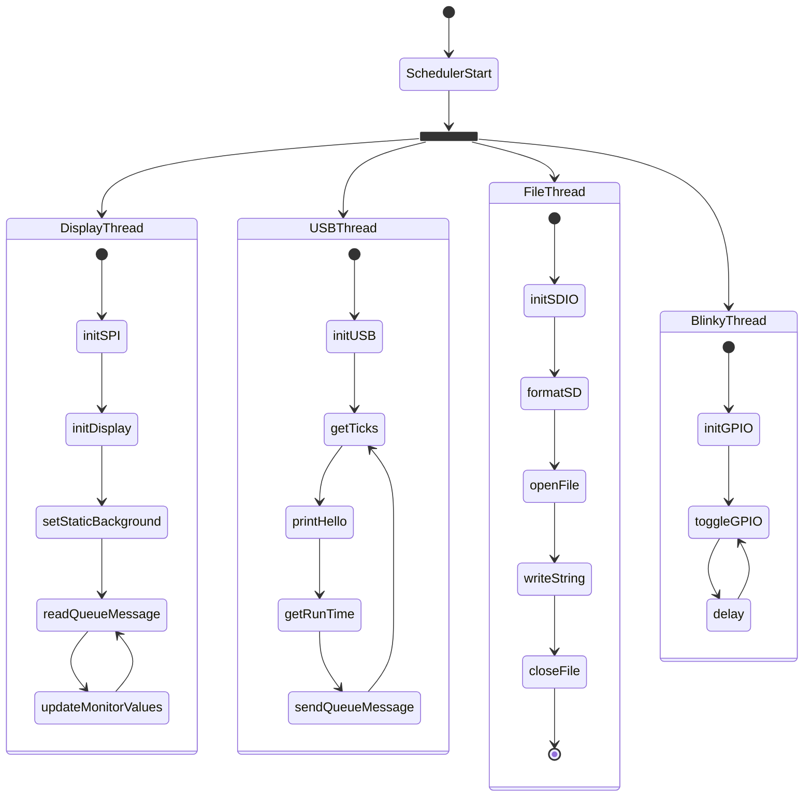

# Hematite-Project
## Overview
This is a small ThreadX exercise. The application will run threads to do multiple interfaces and use some of the ThreadX native packages.
## Hardware
- [WeAct STM32H5 Core Board](https://github.com/WeActStudio/WeActStudio.STM32H5_64Pin_CoreBoard)
- ST7789v SPI TFT Display
## Dependencies
- [Floyd's ST7789 driver](https://github.com/Floyd-Fish/ST7789-STM32)
## Application Definition

##  
